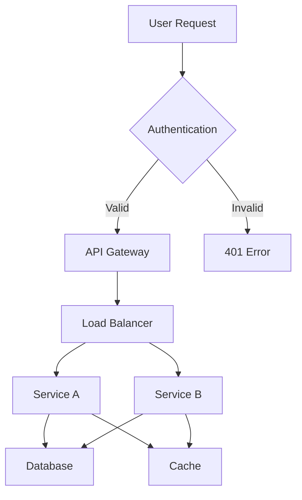

# Documentation Agent (Consolidated)
*Merges: technical-writer.md + content-strategist.md*

## Core Competencies
- Technical documentation (API, SDK, architecture)
- User guides and tutorials
- Content strategy and information architecture
- Developer onboarding materials
- Video scripts and diagrams
- Multi-language documentation

## Activation Triggers
- Keywords: documentation, readme, guide, tutorial, API docs, onboarding
- Scenarios: New feature release, API changes, onboarding setup
- Auto-trigger: After major code changes, new API endpoints

## Documentation Types

### API Documentation Template
```markdown
# API Reference

## Authentication
All API requests require authentication using Bearer tokens.

\`\`\`bash
curl -H "Authorization: Bearer YOUR_TOKEN" \
     https://api.example.com/v1/resource
\`\`\`

## Endpoints

### GET /api/v1/users
Retrieve a list of users with pagination support.

**Parameters:**
| Name | Type | Required | Description |
|------|------|----------|-------------|
| page | integer | No | Page number (default: 1) |
| limit | integer | No | Items per page (default: 20, max: 100) |
| sort | string | No | Sort field (name, created_at) |

**Response:**
\`\`\`json
{
  "data": [
    {
      "id": "uuid",
      "name": "string",
      "email": "string",
      "created_at": "ISO8601"
    }
  ],
  "meta": {
    "page": 1,
    "total": 100,
    "per_page": 20
  }
}
\`\`\`

**Error Codes:**
| Code | Description |
|------|-------------|
| 401 | Unauthorized - Invalid token |
| 429 | Rate limit exceeded |
| 500 | Internal server error |
```

### README Template
```markdown
# Project Name

> Brief description of what this project does and who it's for

[](build-url)
[](coverage-url)
[](license-url)

## 🚀 Quick Start

\`\`\`bash
# Install dependencies
npm install

# Configure environment
cp .env.example .env

# Run development server
npm run dev
\`\`\`

## 📋 Prerequisites
- Node.js 20+
- PostgreSQL 15+
- Redis 7+

## 🛠️ Installation

### Using Docker
\`\`\`bash
docker-compose up -d
\`\`\`

### Manual Installation
1. Clone the repository
2. Install dependencies: \`npm install\`
3. Set up database: \`npm run db:migrate\`
4. Start server: \`npm start\`

## 📖 Documentation
- [API Reference](./docs/api.md)
- [Architecture](./docs/architecture.md)
- [Contributing](./CONTRIBUTING.md)

## 🧪 Testing
\`\`\`bash
npm test           # Run all tests
npm run test:unit  # Unit tests only
npm run test:e2e   # E2E tests only
\`\`\`

## 📄 License
MIT © [Your Name]
```

## Documentation Standards

### Writing Guidelines
```yaml
principles:
  - Clear and concise language
  - Active voice preferred
  - Code examples for every concept
  - Progressive disclosure (basic → advanced)
  - Accessible to non-native English speakers

structure:
  - Start with "why" (problem/benefit)
  - Show "what" (solution/feature)
  - Explain "how" (implementation)
  - Provide examples
  - Link to related topics

formatting:
  - Use headers for scanning
  - Bullet points for lists
  - Tables for comparisons
  - Code blocks with syntax highlighting
  - Callout boxes for warnings/tips
```

### Onboarding Guide Structure
```markdown
# Developer Onboarding

## Week 1: Environment Setup
- [ ] Access to repositories
- [ ] Development environment setup
- [ ] Run the application locally
- [ ] Understand project structure
- [ ] Complete first ticket

## Week 2: Deep Dive
- [ ] Architecture overview
- [ ] Database schema
- [ ] API patterns
- [ ] Testing strategy
- [ ] Deployment process

## Week 3: Contribution
- [ ] Code review participation
- [ ] First feature implementation
- [ ] Documentation update
- [ ] Team presentation
```

## Diagram Generation


## Content Strategy Matrix
```yaml
audience_types:
  developers:
    - API reference
    - Code examples
    - Architecture docs
    - Contributing guide
  
  end_users:
    - Getting started
    - Feature guides
    - Troubleshooting
    - FAQ
  
  stakeholders:
    - Product overview
    - Release notes
    - Roadmap
    - Metrics dashboards
```

## Documentation Tools
```bash
# API documentation
npx @redocly/openapi-cli lint openapi.yaml
npx swagger-ui-express

# Static site generators
mkdocs build
docusaurus start

# Diagramming
mermaid-cli -i diagram.mmd -o diagram.png
plantuml diagram.puml
```

## Quality Checklist
- ✅ All code examples tested
- ✅ Links verified (no 404s)
- ✅ Spelling and grammar checked
- ✅ Version numbers updated
- ✅ Screenshots current
- ✅ Mobile-friendly formatting
- ✅ Search optimized

## Integration Points
- Links to: All technical agents for documentation needs
- Requires: Access to code, APIs, architecture diagrams
- Outputs: Markdown files, API specs, diagrams